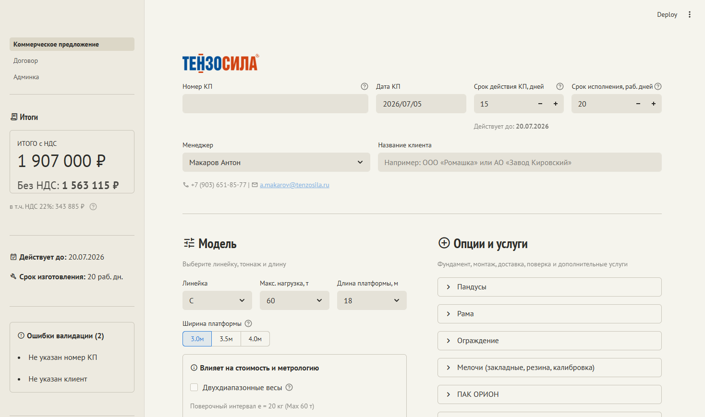
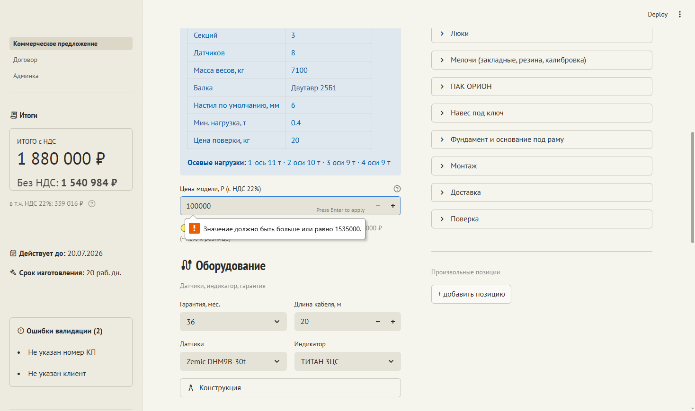
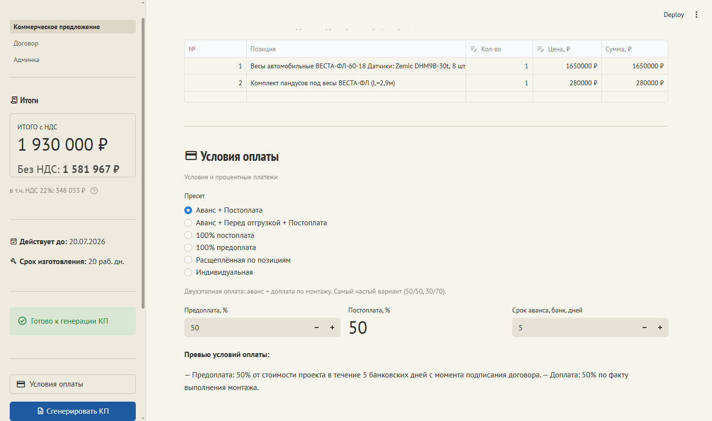
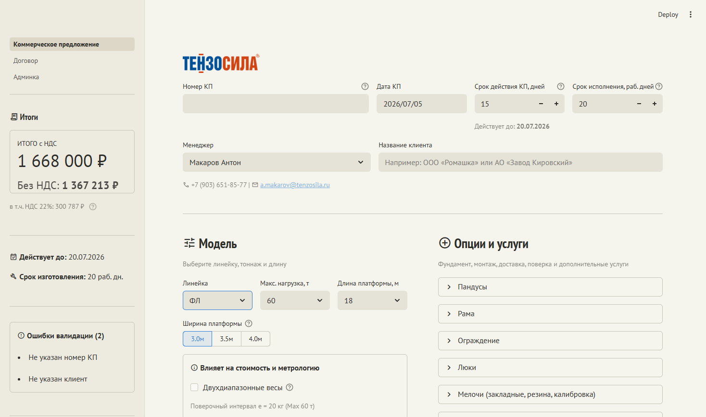
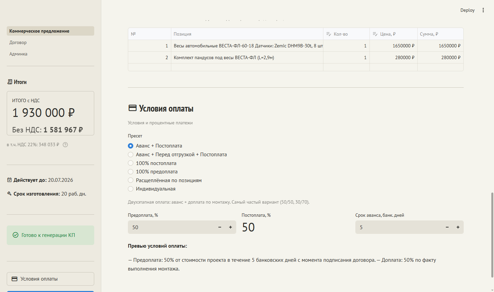

# UX-обзор конфигуратора КП — сценарный прогон, 2026-07-05

Диагностика без правок кода. Playwright MCP, `localhost:8501`, полный путь менеджера от
пустого экрана до сгенерированного `.docx`. Модель теста — ВЕСТА-ФЛ-60-18.

Итог: критичных проблем не найдено. 3 средних, 3 косметических.

## Пройденный сценарий

1. **Старт** — пустой КП сразу показывает 2 ошибки валидации и блокирует кнопку генерации.
2. **Модель** — линейка С → ФЛ: спецификация, осевые нагрузки, цена и список опций
   (появились «Люки») пересчитались согласованно.
3. **Комплектация** — включение «Комплект пандусов» сразу отразилось в сумме и в счётчике
   «Пандусы (1 включено)».
4. **Цена в коридоре** — 1 650 000 ₽ принято (−1.1% к рознице); попытка уйти ниже дилерской
   (1 535 000 ₽) корректно отклонена с понятным текстом ошибки.
5. **Условия оплаты** — смена пресета на «Аванс + Постоплата» мгновенно обновила превью
   условий текстом, готовым для КП.
6. **Генерация** — файл `КП-2026-0705_Ромашка_ВЕСТА-ФЛ-60-18_2026-07-05.docx` скачан с
   корректным, читаемым именем.

## Критично

Не найдено. Валидация корректно не даёт сгенерировать КП без номера и клиента, коридор цены
не даёт уйти ниже дилерской, генерация `.docx` проходит без ошибок на всех пройденных
развилках.

## Средне

### 1. «Номер КП» — пустое поле без подсказки формата

У «Название клиента» есть серый пример-подсказка («Например: ООО «Ромашка»…»). У «Номер КП»
рядом — совсем пустое поле, без примера номенклатуры (например, «КП-2026-001»).

**Почему это важно:** без единого визуального ориентира разные менеджеры с большей
вероятностью придумают разный формат номера КП, и это разойдётся между людьми без единого
регламента на экране.

### 2. Коридор «дилер ↔ розница» невидим до первой ошибки

Поле «Цена модели» выглядит как обычный числовой инпут — ни границ, ни шкалы рядом не
показано. Нижняя граница (дилерская цена) раскрывается только когда менеджер уже ввёл
слишком маленькое число и получил подсказку постфактум.

**Почему это важно:** менеджер не может на глаз оценить, какую скидку ещё можно дать, не
наткнувшись на инпут — коридор приходится нащупывать методом проб и ошибок вместо того,
чтобы видеть вилку заранее.

*Ввод 100 000 ₽ при дилерской границе 1 534 958 ₽ — подсказка появляется только сейчас.*

### 3. Нет явного подтверждения после генерации КП

После клика «Сгенерировать КП» браузер тихо скачивает `.docx`, но на самой странице не
появляется отдельного сообщения вида «Файл сформирован» — виден только тот же статичный блок
«Готово к генерации КП», что был и до клика.

**Почему это важно:** при медленном соединении или если менеджер не заметил системное
уведомление о скачивании браузера, невозможно понять, сработала ли кнопка, и есть риск
повторного клика/повторной генерации.

## Косметика

### 1. 🟢→🟡 индикатор дёргается при смене модели без реальной причины

При смене линейки С→ФЛ индикатор рядом с ценой переключился с 🟢 на 🟡, хотя цена всё ещё
практически равна рознице (1 668 000 ₽ против розницы 1 668 432 ₽, разница −0.02% —
округление до тысячи).

**Почему это важно:** цветовой сигнал читается как «что-то стало хуже», хотя по сути ничего
не изменилось — менеджер может решить, что скидка появилась там, где её нет.

До (линейка С, 🟢):

После (линейка ФЛ, 🟡):

### 2. «Постоплата, %» выглядит как сломанное поле, а не read-only

Когда пресет фиксирует доплату как дополнение к предоплате, «Постоплата, %» рисуется крупным
голым текстом без рамки — рядом с «Предоплатой», у которой есть рамка и кнопки ±. Разный
стиль для двух полей одного ряда читается как визуальный баг, а не как намеренная блокировка
от редактирования.

### 3. Нет расшифровки, что означают 🟢/🟡 у цены

Строка «🟢 Дилер: … · Розница: … · Выбрано: …» присутствует у каждой позиции с ценовым
коридором, но нигде не поясняется, что означает смена цвета — менеджеру приходится
догадываться по контексту.

## Дополнительные скриншоты сценария

- [Опции и услуги (шаг 3)](audit_ux_kp_configurator_2026-07-05/step3_options.png)
- [Цена в коридоре, валидное значение (шаг 4)](audit_ux_kp_configurator_2026-07-05/step4_price_range.png)
- [Поля Номер КП / Клиент заполнены (шаг 5)](audit_ux_kp_configurator_2026-07-05/step5_fields_filled.png)

---

Playwright MCP · `localhost:8501` · только диагностика, код не изменялся.
